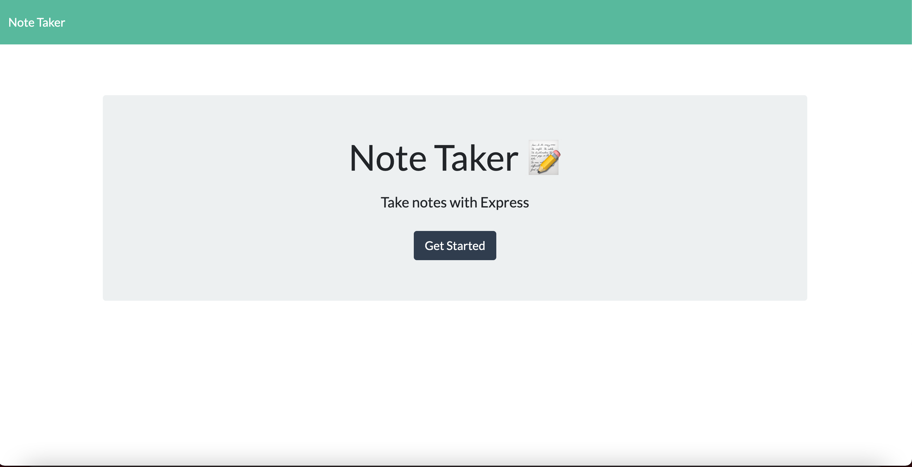
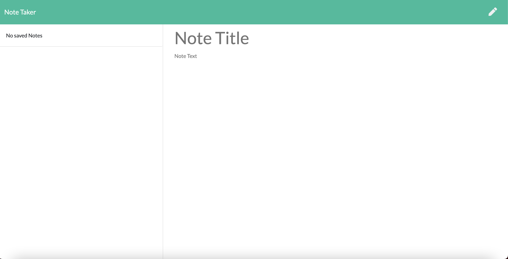

# Note Taker [](https://github.com/sindresorhus/awesome#readme)  

  ## Description  
  A fullstack application using express to create a web-server to save user input to the db.json file and rendering it to the page.  Allowing for the use of multiple fetch methods including Get, Post, and Delete.  The following application is deployed using heroku. 

  ## Table of Contents  
  - [Description](#description) 
  - [Usage](#usage)  
  - [License](#license) 
  - [Deployed](#deployed)   
 
  ## Usage  
  ```

  Use the link to the deployed Heroku page to use the application. 
  When landing on the home page click the new note button to be redirected to the page with previous note and to create a new one.  Use the save button so save new notes to the database and then the new note icon to write a new one. When clicking a previous note then you are presented with the content of that saved note.  

  ```

  ## License  
  
  Copyright (C) 2021 Juawito  

    GNU-3

    This program is free software: you can redistribute it and/or modify
    it under the terms of the GNU General Public License as published by
    the Free Software Foundation, either version 3 of the License, or
    (at your option) any later version.

    This program is distributed in the hope that it will be useful,
    but WITHOUT ANY WARRANTY; without even the implied warranty of
    MERCHANTABILITY or FITNESS FOR A PARTICULAR PURPOSE.  See the
    GNU General Public License for more details.

    You should have received a copy of the GNU General Public License
    along with this program.  If not, see <https://www.gnu.org/licenses/>.  

  ## Deployed
  [Note Taker](https://hidden-river-17314.herokuapp.com/)  

    

  